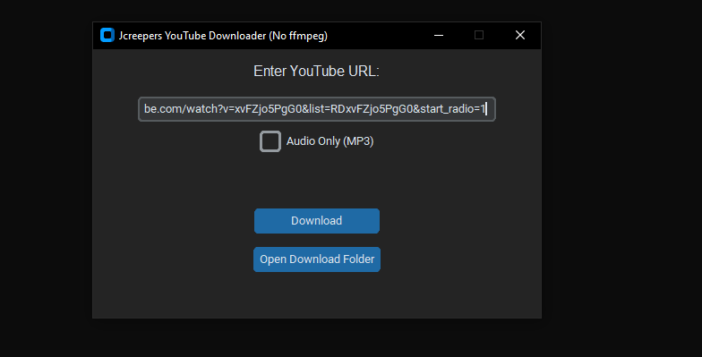

# 📥 YouTube Downloader (yt-dlp + CustomTkinter)

A sleek, lightweight desktop app for downloading YouTube videos and audio directly to your PC.  
Built with [yt-dlp](https://github.com/yt-dlp/yt-dlp) and [CustomTkinter](https://github.com/TomSchimansky/CustomTkinter) for a modern, user-friendly experience.

---

## 🚀 Features
 Download YouTube **videos** in MP4 format  
 Extract **audio only** in MP3 format (optional)  
 Supports **standard YouTube links**, Shorts, and Clips  
 Clean and intuitive GUI with dark mode  
 No need for external dependencies like ffmpeg  
---

## 🖥️ Screenshots

---

## 📂 Download Location
All downloads are saved to:  C:\Users<YourName>\Documents\YoutubeVideos

git clone https://github.com/<yourusername>/youtube-downloader.git
cd youtube-downloader

📝 How to Use
Paste a valid YouTube URL into the entry box.
(Optional) Check "Audio Only" if you just want MP3.
Click Download and wait for it to complete.
Click Open Download Folder to view your saved media.

